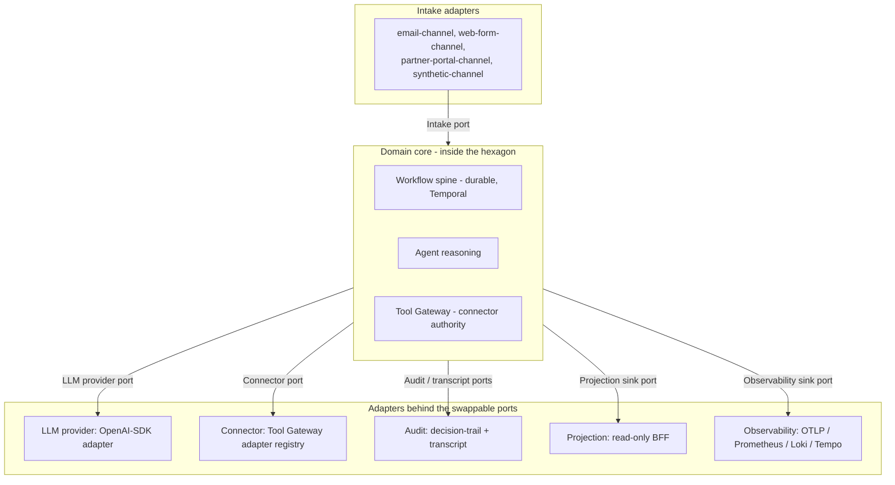

# Chorus

[](https://github.com/krazyuniks/chorus/actions/workflows/ci.yml)
[](https://github.com/krazyuniks/chorus/actions/workflows/replay.yml)
[](https://github.com/krazyuniks/chorus/actions/workflows/eval.yml)

Chorus is a hexagonal, ports-and-adapters exemplar for governed agentic
systems, with data-contract-first design at every port. A small fixed set of
named ports separates the domain core - the workflow spine, the agent
reasoning paths, and the tool authority layer - from everything that talks to
the outside world or to a swappable subsystem. Every payload that crosses a
port is validated against an explicit schema before the domain core sees it
and before any adapter accepts it. The thesis is that governed agentic systems
benefit specifically from this shape, because agents amplify the cost of every
leaky boundary: a provider quirk, a transport-level type drift, or a connector
that mutates outside its grant becomes hard to detect and harder to undo when
reasoning sits between input and effect.

## The six named ports

The hexagon has six named ports. The list is intentionally short.

| Port | Role |
|---|---|
| Intake | Inbound business work entering the system. |
| LLM provider | Model invocations with a route catalogue and provider neutrality. |
| Connector | External-action authority via the Tool Gateway. |
| Audit / transcript | Two streams: a structured decision-trail port and a full-fidelity transcript port. |
| Projection sink | Derives read models for inspection. |
| Observability sink | Traces, metrics, logs, and optional LLM observability. |

Workflow durability is not a port. The workflow shape is the domain's
operational backbone and sits inside the domain core. The reset bundle and
[`architecture.md`](docs/architecture.md) carry the full rationale.

## The hexagon



The adapter inventory behind each port, as closed in R4 and extended in R5.
UC1 is locally runnable through Mailpit email intake. UC2 is locally runnable
through the documented synthetic email legal-intake fixture: the one-shot
command validates the intake contract sample, starts the UC2 workflow, and the
relay/projection loop exposes workflow progress, decision-trail rows, Tool
Gateway verdicts, and the `engagement_letter.send` approval package in the
existing BFF/UI surfaces. UC3 is locally runnable through the documented
synthetic email advice-enquiry fixture on the same shape: the one-shot command
validates the intake contract sample, starts the UC3 workflow, and the
relay/projection loop exposes workflow progress, decision-trail rows, Tool
Gateway verdicts, and the `suitability_report.issue` approval package in the
existing BFF/UI surfaces.

| Port | UC1 adapters | UC2 adapters | UC3 adapters |
|---|---|---|---|
| Intake | email-channel, web-form-channel, partner-portal-channel, synthetic-channel | email-channel, corporate-intake-form, intermediary-referral-channel | web-form-channel, email-channel, introducer-referral-channel |
| LLM provider | OpenAI-SDK adapter; route metadata: active local `recorded-replay` (`local` / `uc1-happy-path-v1`), DeepSeek `deepseek-v4-flash` (dev), and OpenAI `gpt-5.4-mini-2026-03-17` (demo / eval); worker startup fails when an approved live route is selected without its credential env var; explicit OpenAI and DeepSeek replay integrations run with `just test-live-openai` / `just test-live-deepseek` when the matching key is set | same adapter and route shape | same adapter and route shape |
| Connector | sandbox-crm, sandbox-referral-inbox, sandbox-decline-ledger, sandbox-outbound-comms, sandbox-customer-profile, sandbox-product-catalogue | adds sandbox-conflict-check, sandbox-kyc-bo, sandbox-aml-record-store, sandbox-engagement-letter-store | adds sandbox-attitude-to-risk-profiler, sandbox-capacity-for-loss-tool, sandbox-suitability-report-store, sandbox-platform-research |
| Audit / transcript | decision-trail adapter, transcript adapter (Postgres-backed) | same | same |
| Projection sink | Postgres projection adapter; Redpanda event consumer feeding the read-only BFF | same | same |
| Observability sink | OTLP adapter; Prometheus / Loki / Tempo adapters; optional LLM observability sidecar adapter | same | same |

## Use cases

Chorus carries three modelled use cases whose role is to demonstrate adapter
reuse across different UK regulatory regimes.

| Slot | Use case | Regulator |
|---|---|---|
| UC1 | UK personal-lines insurance broking inbound quote qualification. Fully modelled in [`docs/product-brief.md`](docs/product-brief.md) and [`docs/domain-model.md`](docs/domain-model.md). | FCA general insurance distribution (ICOBS, PROD 4, Consumer Duty). |
| UC2 | UK legal services intake and conflict check, corporate / commercial practice area. Modelled in [`docs/product-brief-uc2.md`](docs/product-brief-uc2.md) and [`docs/domain-model-uc2.md`](docs/domain-model-uc2.md). | SRA Code of Conduct, conflict-of-interest rules, AML obligations. |
| UC3 | UK independent financial advice suitability intake. Modelled in [`docs/product-brief-uc3.md`](docs/product-brief-uc3.md) and [`docs/domain-model-uc3.md`](docs/domain-model-uc3.md). | FCA retail investment advice (COBS 9 suitability, PROD, Consumer Duty). |

The six named ports and the workflow spine stay constant across all three use
cases. The intake channel adapters, the connector inventory, the approval
policy, and the regulator-specific audit content vary per use case. That
adapter-reuse hypothesis is the centre of the thesis; see
[`docs/r1-adapter-mapping.md`](docs/r1-adapter-mapping.md).

## How to read this repo

The documentation is living design material, not a phase history. Read in this
order:

1. [`docs/overview.md`](docs/overview.md) - project overview and use-case set.
2. [`docs/architecture.md`](docs/architecture.md) - current architecture reference.
3. [`docs/transformation/engineering-thesis.md`](docs/transformation/engineering-thesis.md) - long-form thesis.
4. [`docs/product-brief.md`](docs/product-brief.md) - UC1 product description.
5. [`docs/domain-model.md`](docs/domain-model.md) - UC1 ubiquitous language.
6. [`docs/product-brief-uc2.md`](docs/product-brief-uc2.md) and [`docs/domain-model-uc2.md`](docs/domain-model-uc2.md) - UC2 product and domain scope.
7. [`docs/product-brief-uc3.md`](docs/product-brief-uc3.md) and [`docs/domain-model-uc3.md`](docs/domain-model-uc3.md) - UC3 product and domain scope.
8. [`docs/r1-use-case-confirmation.md`](docs/r1-use-case-confirmation.md) - UC2 and UC3 confirmation.
9. [`docs/r1-adapter-mapping.md`](docs/r1-adapter-mapping.md) - adapter reuse across the three use cases.
10. [`docs/evidence-map.md`](docs/evidence-map.md) - claims mapped to artefacts, port by port.
11. [`docs/runbook.md`](docs/runbook.md) - local run and inspection path.
12. [`docs/transformation/r4-implementation-backlog.md`](docs/transformation/r4-implementation-backlog.md) - closed R4 strategy, backlog, evidence notes, and closure exceptions.

## How to run it locally

Chorus runs entirely on a local sandbox stack: Postgres, Redpanda, Temporal,
Mailpit, and a local connector substrate, with OpenTelemetry and Grafana for
observability. There is no hosted dependency. The full command path plus UC1,
UC2, and UC3 walk-throughs are in [`docs/runbook.md`](docs/runbook.md).

The UC2 local operator loop is:

```bash
just up && just db-migrate && just schemas-register && just doctor
```

```bash
uv run python -m chorus.workflows.uc2_synthetic_intake
```

```bash
just relay-once && just project-once
```

The default UC2 fixture starts workflow
`uc2-legal-ddbe16eabd909b417f25119f` on a clean database. Inspect it at
`http://localhost:18001/api/workflows/uc2-legal-ddbe16eabd909b417f25119f`,
or in the frontend at
`http://localhost:5174/workflows/uc2-legal-ddbe16eabd909b417f25119f` when
`just frontend-dev` is running. The Temporal UI at `http://localhost:8233`
can inspect the same workflow ID. Re-running the same command prints
`started: false` when that stable workflow ID already exists.

The UC3 local operator loop is:

```bash
just up && just db-migrate && just schemas-register && just doctor
```

```bash
uv run python -m chorus.workflows.uc3_synthetic_intake
```

```bash
just relay-once && just project-once
```

The default UC3 fixture is
`contracts/intake/uc3/samples/email_advice_enquiry.sample.json`. On a clean
database it starts workflow `uc3-advice-3e7d1d3cd3d8236776a0fb8a` for advice
enquiry ref `advice_enquiry_advice_email_001` with correlation ID
`cor_advice_email_001`. Inspect it at
`http://localhost:18001/api/workflows/uc3-advice-3e7d1d3cd3d8236776a0fb8a`,
or in the frontend at
`http://localhost:5174/workflows/uc3-advice-3e7d1d3cd3d8236776a0fb8a` when
`just frontend-dev` is running. The Temporal UI at `http://localhost:8233`
can inspect the same workflow ID. Re-running the same command prints
`started: false` when that stable workflow ID already exists.

The explicit live OpenAI replay check is:

```bash
just test-live-openai
```

It requires `OPENAI_API_KEY` in the process environment or `.env`; without
that key the command fails before provider calls.

The explicit live DeepSeek replay check is:

```bash
just test-live-deepseek
```

It requires `DEEPSEEK_API_KEY` in the process environment or `.env`; without
that key the command fails before provider calls.

The runtime code carries the named-port surface: the LLM provider port,
connector adapter registry, audit / transcript split, workflow spine with UC1,
UC2, and UC3 definitions on it, per-port projection / doctor decomposition,
and invariant-plus-replay eval. R4 is closed as local POC evidence; R5 is
closing the documented runnable gaps, with UC2 and UC3 now having local
synthetic intake commands and relay/projection evidence loops.
The live-provider startup credential gate is in place. OpenAI live-provider
replay integration now runs explicitly with `just test-live-openai`, hard
fails when `OPENAI_API_KEY` is absent, and compares UC1, UC2, and UC3
happy-path captured transcripts through `demo-eval-canonical`. DeepSeek
live-provider replay integration runs with the `just test-live-deepseek`
command, hard fails when `DEEPSEEK_API_KEY` is absent, and compares the same
happy-path captured transcripts through `dev`. Each comparator record is
persisted to `replay_run_records`, joining the recorded-replay invocation and
transcript refs with the live alternate route. The
closed R4 backlog and closure notes live in
[`docs/transformation/r4-implementation-backlog.md`](docs/transformation/r4-implementation-backlog.md).

## Current Work

R5 is active. Work proceeds from the R5 backlog, with documented local
runnable paths and live replay persistence now landed and R5 closure the
remaining step, without widening into production connectors or hosted deployment.
Architectural decisions are recorded in [`adrs/`](adrs/); only current
decisions are kept in the repository.

## License

MIT. See [`LICENSE`](LICENSE).
