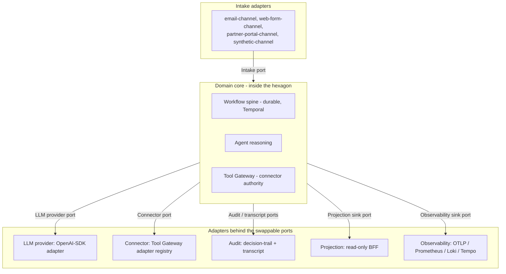

# Chorus

Chorus is a hexagonal, ports-and-adapters exemplar for governed agentic
systems, with data-contract-first design at every port. A small fixed set of
named ports separates the domain core - the workflow spine, the agent
reasoning paths, and the tool authority layer - from everything that talks to
the outside world or to a swappable subsystem. Every payload that crosses a
port is validated against an explicit schema before the domain core sees it
and before any adapter accepts it. The thesis is that governed agentic systems
benefit specifically from this shape, because agents amplify the cost of every
leaky boundary: a provider quirk, a transport-level type drift, or a connector
that mutates outside its grant becomes hard to detect and harder to undo when
reasoning sits between input and effect.

## The six named ports

The hexagon has six named ports. The list is intentionally short.

| Port | Role |
|---|---|
| Intake | Inbound business work entering the system. |
| LLM provider | Model invocations with a route catalogue and provider neutrality. |
| Connector | External-action authority via the Tool Gateway. |
| Audit / transcript | Two streams: a structured decision-trail port and a full-fidelity transcript port. |
| Projection sink | Derives read models for inspection. |
| Observability sink | Traces, metrics, logs, and optional LLM observability. |

Workflow durability is not a port. The workflow shape is the domain's
operational backbone and sits inside the domain core. The reset bundle and
[`architecture.md`](docs/architecture.md) carry the full rationale.

## The hexagon

The adapter inventory behind each port, as defined by the R1 adapter mapping.
UC1 is the worked set; UC2 and UC3 are confirmed and land in R4 after their
full product briefs and domain models are written.

| Port | UC1 adapters | UC2 adapters | UC3 adapters |
|---|---|---|---|
| Intake | email-channel, web-form-channel, partner-portal-channel, synthetic-channel | email-channel, corporate-intake-form, intermediary-referral-channel | web-form-channel, email-channel, introducer-referral-channel |
| LLM provider | OpenAI-SDK adapter; routes: DeepSeek V4-Flash (dev), gpt-5.4-mini (demo / eval) | same adapter and route shape | same adapter and route shape |
| Connector | sandbox-crm, sandbox-referral-inbox, sandbox-decline-ledger, sandbox-outbound-comms, sandbox-customer-profile, sandbox-product-catalogue | adds sandbox-conflict-check, sandbox-kyc-bo, sandbox-aml-record-store, sandbox-engagement-letter-store | adds sandbox-attitude-to-risk-profiler, sandbox-capacity-for-loss-tool, sandbox-suitability-report-store, sandbox-platform-research |
| Audit / transcript | decision-trail adapter, transcript adapter (Postgres-backed) | same | same |
| Projection sink | Postgres projection adapter; Redpanda event consumer feeding the read-only BFF | same | same |
| Observability sink | OTLP adapter; Prometheus / Loki / Tempo adapters; optional LLM observability sidecar adapter | same | same |

## Use cases

Chorus carries two modelled use cases plus one confirmed use case whose role
is to demonstrate adapter reuse across different UK regulatory regimes.

| Slot | Use case | Regulator |
|---|---|---|
| UC1 | UK personal-lines insurance broking inbound quote qualification. Fully modelled in [`docs/product-brief.md`](docs/product-brief.md) and [`docs/domain-model.md`](docs/domain-model.md). | FCA general insurance distribution (ICOBS, PROD 4, Consumer Duty). |
| UC2 | UK legal services intake and conflict check, corporate / commercial practice area. Modelled in [`docs/product-brief-uc2.md`](docs/product-brief-uc2.md) and [`docs/domain-model-uc2.md`](docs/domain-model-uc2.md). | SRA Code of Conduct, conflict-of-interest rules, AML obligations. |
| UC3 | UK independent financial advice inbound enquiry. Confirmed. | FCA retail investment advice (COBS 9 suitability, PROD, Consumer Duty). |

The six named ports and the workflow spine stay constant across all three use
cases. The intake channel adapters, the connector inventory, the approval
policy, and the regulator-specific audit content vary per use case. That
adapter-reuse hypothesis is the centre of the thesis; see
[`docs/r1-adapter-mapping.md`](docs/r1-adapter-mapping.md).

## How to read this repo

The documentation is living design material, not a phase history. Read in this
order:

1. [`docs/overview.md`](docs/overview.md) - project overview and use-case set.
2. [`docs/architecture.md`](docs/architecture.md) - current architecture reference.
3. [`docs/transformation/engineering-thesis.md`](docs/transformation/engineering-thesis.md) - long-form thesis.
4. [`docs/product-brief.md`](docs/product-brief.md) - UC1 product description.
5. [`docs/domain-model.md`](docs/domain-model.md) - UC1 ubiquitous language.
6. [`docs/product-brief-uc2.md`](docs/product-brief-uc2.md) and [`docs/domain-model-uc2.md`](docs/domain-model-uc2.md) - UC2 product and domain scope.
7. [`docs/r1-use-case-confirmation.md`](docs/r1-use-case-confirmation.md) - UC2 and UC3 confirmation.
8. [`docs/r1-adapter-mapping.md`](docs/r1-adapter-mapping.md) - adapter reuse across the three use cases.
9. [`docs/evidence-map.md`](docs/evidence-map.md) - claims mapped to artefacts, port by port.
10. [`docs/runbook.md`](docs/runbook.md) - local run and inspection path.
11. [`docs/transformation/r4-implementation-backlog.md`](docs/transformation/r4-implementation-backlog.md) - active R4 strategy, backlog, and continuation handoff.

## How to run it locally

Chorus runs entirely on a local sandbox stack: Postgres, Redpanda, Temporal,
Mailpit, and a local connector substrate, with OpenTelemetry and Grafana for
observability. There is no hosted dependency. The full command path and the
UC1 happy-path walk-through are in [`docs/runbook.md`](docs/runbook.md).

The runtime code carries the named-port surface: the LLM provider port,
connector adapter registry, audit / transcript split, workflow spine with UC1
on it, per-port projection / doctor decomposition, and invariant-plus-replay
eval. R4 wires UC1, UC2, and UC3 for local POC readiness after the R4 design
decisions and UC3 product artefacts are written. The active R4 backlog
and continuation prompt live in
[`docs/transformation/r4-implementation-backlog.md`](docs/transformation/r4-implementation-backlog.md).

## Current Work

R4 is in preflight. The next work is product/domain scoping for UC3, then
multi-use-case implementation on the existing named-port architecture.
Architectural decisions are recorded in [`adrs/`](adrs/); only current
decisions are kept in the repository.

## License

MIT. See [`LICENSE`](LICENSE).
