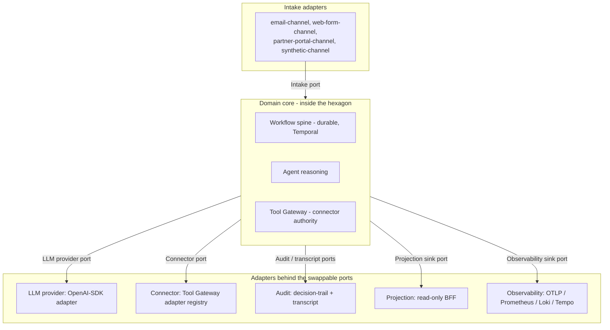

# Chorus

Chorus is a hexagonal, ports-and-adapters exemplar for governed agentic
systems, with data-contract-first design at every port. A small fixed set of
named ports separates the domain core - the workflow spine, the agent
reasoning paths, and the tool authority layer - from everything that talks to
the outside world or to a swappable subsystem. Every payload that crosses a
port is validated against an explicit schema before the domain core sees it
and before any adapter accepts it. The thesis is that governed agentic systems
benefit specifically from this shape, because agents amplify the cost of every
leaky boundary: a provider quirk, a transport-level type drift, or a connector
that mutates outside its grant becomes hard to detect and harder to undo when
reasoning sits between input and effect.

## The six named ports

The hexagon has six named ports. The list is intentionally short.

| Port | Role |
|---|---|
| Intake | Inbound business work entering the system. |
| LLM provider | Model invocations with a route catalogue and provider neutrality. |
| Connector | External-action authority via the Tool Gateway. |
| Audit / transcript | Two streams: a structured decision-trail port and a full-fidelity transcript port. |
| Projection sink | Derives read models for inspection. |
| Observability sink | Traces, metrics, logs, and optional LLM observability. |

Workflow durability is not a port. The workflow shape is the domain's
operational backbone and sits inside the domain core. The reset bundle and
[`architecture.md`](docs/architecture.md) carry the full rationale.

## The hexagon

The adapter inventory behind each port, as defined by the R1 adapter mapping.
UC1 is the worked set; UC2 and UC3 are confirmed and land in R3 and R4.

| Port | UC1 adapters | UC2 adapters | UC3 adapters |
|---|---|---|---|
| Intake | email-channel, web-form-channel, partner-portal-channel, synthetic-channel | email-channel, corporate-intake-form, intermediary-referral-channel | web-form-channel, email-channel, introducer-referral-channel |
| LLM provider | OpenAI-SDK adapter; routes: DeepSeek V4-Flash (dev), gpt-5.4-mini (demo / eval) | same adapter and route shape | same adapter and route shape |
| Connector | sandbox-crm, sandbox-referral-inbox, sandbox-decline-ledger, sandbox-outbound-comms, sandbox-customer-profile, sandbox-product-catalogue | adds sandbox-conflict-check, sandbox-kyc-bo, sandbox-aml-record-store, sandbox-engagement-letter-store | adds sandbox-attitude-to-risk-profiler, sandbox-capacity-for-loss-tool, sandbox-suitability-report-store, sandbox-platform-research |
| Audit / transcript | decision-trail adapter, transcript adapter (Postgres-backed) | same | same |
| Projection sink | Postgres projection adapter; Redpanda event consumer feeding the read-only BFF | same | same |
| Observability sink | OTLP adapter; Prometheus / Loki / Tempo adapters; optional LLM observability sidecar adapter | same | same |

## Use cases

Chorus carries one fully modelled use case plus two confirmed use cases whose
role is to demonstrate adapter reuse across different UK regulatory regimes.

| Slot | Use case | Regulator |
|---|---|---|
| UC1 | UK personal-lines insurance broking inbound quote qualification. Fully modelled in [`docs/product-brief.md`](docs/product-brief.md) and [`docs/domain-model.md`](docs/domain-model.md). | FCA general insurance distribution (ICOBS, PROD 4, Consumer Duty). |
| UC2 | UK legal services intake and conflict check, corporate / commercial practice area. Confirmed. | SRA Code of Conduct, conflict-of-interest rules, AML obligations. |
| UC3 | UK independent financial advice inbound enquiry. Confirmed. | FCA retail investment advice (COBS 9 suitability, PROD, Consumer Duty). |

The six named ports and the workflow spine stay constant across all three use
cases. The intake channel adapters, the connector inventory, the approval
policy, and the regulator-specific audit content vary per use case. That
adapter-reuse hypothesis is the centre of the thesis; see
[`docs/r1-adapter-mapping.md`](docs/r1-adapter-mapping.md).

## How to read this repo

The reset bundle is the architectural authority. Read in this order.

The reset bundle, in [`docs/transformation/`](docs/transformation/):

1. [`README.md`](docs/transformation/README.md) - the reset control point.
2. [`engineering-thesis.md`](docs/transformation/engineering-thesis.md) - the long-form thesis. Load-bearing.
3. [`context-and-intent.md`](docs/transformation/context-and-intent.md) - why the reset exists.
4. [`domain-refocus-plan.md`](docs/transformation/domain-refocus-plan.md) - the UK-regulated use-case set.
5. [`engineering-reset-roadmap.md`](docs/transformation/engineering-reset-roadmap.md) - the reset phases.
6. [`current-state-inventory.md`](docs/transformation/current-state-inventory.md) - the reset baseline.
7. [`code-refactor-directions.md`](docs/transformation/code-refactor-directions.md) - the four engineering smells.
8. [`eval-reshape-directions.md`](docs/transformation/eval-reshape-directions.md) - invariant-based eval and replay-as-comparison.

The R1 product and domain artefacts, in [`docs/`](docs/):

9. [`product-brief.md`](docs/product-brief.md) - the UC1 product description.
10. [`domain-model.md`](docs/domain-model.md) - the UC1 ubiquitous language.
11. [`r1-use-case-confirmation.md`](docs/r1-use-case-confirmation.md) - the UC2 and UC3 confirmation.
12. [`r1-adapter-mapping.md`](docs/r1-adapter-mapping.md) - how each use case exercises the ports.
13. [`r1-exit-criteria.md`](docs/r1-exit-criteria.md) - the R1 sign-off.

The top-level architecture docs:

14. [`docs/overview.md`](docs/overview.md) - the project overview.
15. [`docs/architecture.md`](docs/architecture.md) - the architecture reference.
16. [`docs/evidence-map.md`](docs/evidence-map.md) - claims mapped to artefacts, port by port.
17. [`docs/runbook.md`](docs/runbook.md) - how to run and inspect the system locally.
18. [`docs/r2-exit-criteria.md`](docs/r2-exit-criteria.md) - the R2 sign-off.

## How to run it locally

Chorus runs entirely on a local sandbox stack: Postgres, Redpanda, Temporal,
Mailpit, and a local connector substrate, with OpenTelemetry and Grafana for
observability. There is no hosted dependency. The full command path and the
UC1 happy-path walk-through are in [`docs/runbook.md`](docs/runbook.md).

The runtime code in the repository is the pre-reset implementation. R3
(contract and code terminology refactor) is the phase that moves the code onto
the named-port surface and lands the UC1 adapters; R4 wires UC1, UC2, and UC3
for local POC readiness. The runbook is honest about which commands run today
and which describe the post-R3 shape.

## Status

| Phase | State |
|---|---|
| R0.5 - design codification (the ports-and-adapters thesis) | Complete, 2026-05-19. |
| R1 - product and domain reframing | Complete, 2026-05-20. |
| R2 - documentation architecture refactor | Complete, 2026-05-20. |
| ADR writing pass | Complete, 2026-05-20. ADRs 0017 (LangGraph removal), 0018 (LLM provider port), 0019 (audit ports plus replay-eval), 0020 (domain refocus). |
| R3 - contract and code terminology refactor | Next. |
| R4 - local POC readiness across UC1, UC2, UC3 | Pending. |

Architectural decisions are recorded in [`adrs/`](adrs/). ADRs 0017 to 0020
record the decisions of the transformation reset.

The pre-reset phase history (Phase 0 through Phase 2E) is preserved in
[`docs/transformation/phase-2-archive.md`](docs/transformation/phase-2-archive.md).
Deployment left the Chorus repository in the reset; the parked
production-readiness pack sits in
[`docs/transformation/parked-phase-2e/`](docs/transformation/parked-phase-2e/).

## License

MIT. See [`LICENSE`](LICENSE).
