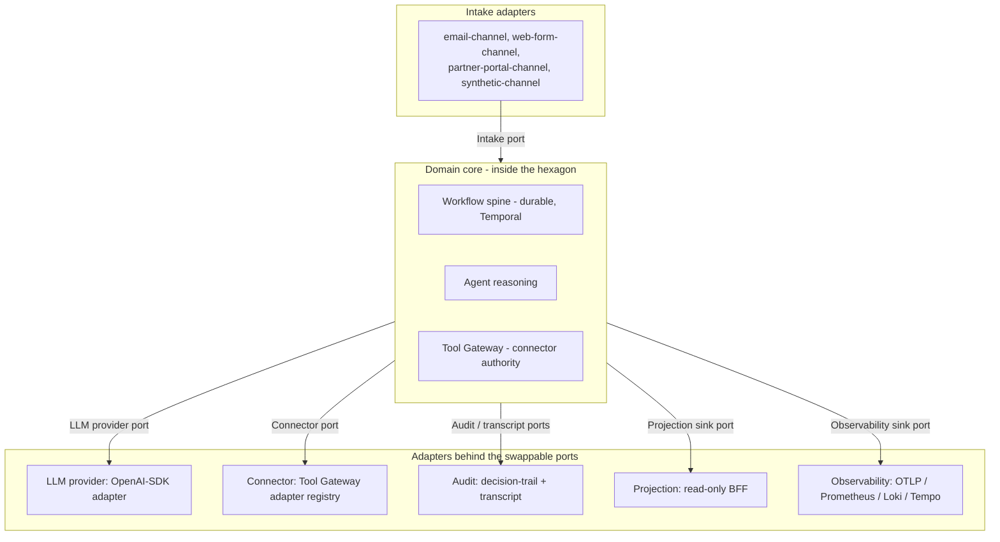

# Chorus - Architecture

## Purpose

This is the architecture reference for Chorus. It describes the hexagon, the
six named ports, the contract-first discipline, and the invariants each port
enforces.

The thesis statement this document elaborates is
[`transformation/engineering-thesis.md`](transformation/engineering-thesis.md);
that document and the rest of the reset bundle in
[`transformation/`](transformation/) are the architectural authority. For the
worked UC1 use case see [`product-brief.md`](product-brief.md) and
[`domain-model.md`](domain-model.md); for the modelled UC2 use case see
[`product-brief-uc2.md`](product-brief-uc2.md) and
[`domain-model-uc2.md`](domain-model-uc2.md); for the modelled UC3 use case see
[`product-brief-uc3.md`](product-brief-uc3.md) and
[`domain-model-uc3.md`](domain-model-uc3.md). For how each use case exercises
the ports see [`r1-adapter-mapping.md`](r1-adapter-mapping.md).

This document describes the architecture the project carries today. R3
landed the named-port surface in code; the
[implementation status](#implementation-status) section at the end records
which checkpoints landed which pieces, what R4 closed, and what R4 explicitly
deferred.

## The hexagon and the six named ports

A small fixed set of named ports separates the domain core from anything that
talks to the outside world or to a swappable subsystem. The domain core does
not know which adapter is active.

The adapter inventory behind each port, as defined by the R1 adapter mapping
and closed R4 evidence. UC1 is runnable through Mailpit/email intake. UC2 is
runnable through the documented synthetic email legal-intake fixture and the
shared relay/projection evidence loop. UC3 is runnable through the documented
synthetic email advice-enquiry fixture and the same shared relay/projection
evidence loop.

| Port | UC1 adapters | UC2 adapters | UC3 adapters |
|---|---|---|---|
| Intake | email-channel, web-form-channel, partner-portal-channel, synthetic-channel | email-channel, corporate-intake-form, intermediary-referral-channel | web-form-channel, email-channel, introducer-referral-channel |
| LLM provider | OpenAI-SDK adapter; route metadata: active local `recorded-replay` (`local` / `uc1-happy-path-v1`), DeepSeek `deepseek-v4-flash` (dev), and OpenAI `gpt-5.4-mini-2026-03-17` (demo / eval) | same adapter and route shape | same adapter and route shape |
| Connector | sandbox-crm, sandbox-referral-inbox, sandbox-decline-ledger, sandbox-outbound-comms, sandbox-customer-profile, sandbox-product-catalogue | adds sandbox-conflict-check, sandbox-kyc-bo, sandbox-aml-record-store, sandbox-engagement-letter-store | adds sandbox-attitude-to-risk-profiler, sandbox-capacity-for-loss-tool, sandbox-suitability-report-store, sandbox-platform-research |
| Audit / transcript | decision-trail adapter, transcript adapter (Postgres-backed) | same | same |
| Projection sink | Postgres projection adapter; Redpanda event consumer feeding the read-only BFF | same | same |
| Observability sink | OTLP adapter; Prometheus / Loki / Tempo adapters; optional LLM observability sidecar adapter | same | same |

## Contract-first discipline at every port

Every payload crossing a port is validated against an explicit schema before
the domain core sees it and before any adapter accepts it. Contracts are the
source of truth for shape, not the implementation. An adapter that violates the
contract fails at the boundary, with a contract violation, rather than
surfacing later as a wrong decision deep in business logic.

Contracts are JSON Schema. Generated models, representative samples, and a
drift gate move with every schema change. R3 rewrote the contract set around
the six named ports, with use-case-specific payload schemas at the intake and
connector ports. R4 closes with UC2 and UC3 intake and connector contracts,
definition-first workflows on the shared spine, deterministic sandbox
connector adapters, Tool Gateway grants, approval-package inspection,
conduct-invariant modules, read-only projection / BFF / UI fixture evidence,
and schema-only eval fixtures. R5 adds a documented UC2 synthetic
email-intake adapter and recorded-replay route policies for UC2 workflow
agent tasks plus workflow-path eval playback for one happy fixture and one
conflict-exception branch, with the happy-path evidence projected into the
existing BFF/UI inspection surfaces through the Redpanda relay/projection
loop. R5 also adds a documented UC3 synthetic email advice intake adapter and
shared-worker registration plus recorded-replay route policies for UC3
workflow agent tasks and workflow-path eval playback for the happy
suitability-report issue fixture and a Consumer Duty vulnerability-support
handoff branch, with the happy issue evidence projected into the existing
BFF/UI inspection surfaces through the Redpanda relay/projection loop.
Live-provider activation remains an explicit closure exception.

## Workflow durability is not a port

Workflow durability is internal to the domain core. The workflow shape - the
ordered sequence of intake, classification, context gathering, a proposed
action, approval where the regulator demands it, routing, and closure - is the
domain's operational backbone, and it does not vary per use case. Temporal is
the workflow engine; the Temporal integration is held to the same adapter
discipline as anything else, but the architectural thesis is not "Temporal
everywhere". It is the named-port surface. The workflow spine, the agent
reasoning paths, and the Tool Gateway authority logic all sit on the domain
side of the hexagon.

## The intake port

The intake port receives inbound business work. Each channel adapter
contract-validates its inbound payload and normalises it to a domain-side
record, with the channel preserved as provenance.

| Aspect | Detail |
|---|---|
| Role | Inbound business work entering the system. |
| Adapter contract shape | A per-channel inbound payload schema (for UC1: `EmailEnquiry`, `WebFormEnquiry`, `PartnerPortalSubmission`; for UC3: `WebAdviceEnquiry`, `EmailAdviceEnquiry`, `IntroducerReferralIntake`), each normalised to a single domain-side record. |
| Adapter inventory | UC1: email-channel, web-form-channel, partner-portal-channel, plus a synthetic-channel that injects authored fixtures through the same path. UC2 and UC3 swap the channel set; the port does not change. |
| Invariants | Every inbound payload validates against its channel contract before the domain core accepts it. Each channel adapter carries a channel-specific idempotency key, and the port maps that key to one domain work identifier. |

## The LLM provider port

The LLM provider port carries model invocations. It is the most consequential
adapter surface in the project and must be provider-agnostic by construction.
The domain core calls the port with structured invocation arguments and
receives a structured invocation result; it never talks to a provider directly.

| Aspect | Detail |
|---|---|
| Role | Model invocations, with a route catalogue and provider neutrality. |
| Adapter contract shape | A structured invocation-argument schema and a structured invocation-result schema, plus a route-catalogue-entry recorded on every call. |
| Adapter inventory | One adapter: the OpenAI Python SDK against any OpenAI-compatible chat-completions endpoint, configured per route. |
| Invariants | No invocation leaves the port without a route catalogue entry, an audit and transcript pair, and contract-validated arguments. Agent code cannot reach a provider SDK outside the adapter. |

The adapter is the OpenAI Python SDK treated as a transport, not as a
commitment to OpenAI as a provider. Provider-specific code is contained inside
the adapter and exposed only as configuration: base URL, API key, model
identifier, and provider-specific parameters such as thinking-mode toggles and
tool-use schema variants.

Before the Agent Runtime calls the provider port, it resolves the approved
agent registry row, loads the repo-local `prompt_reference`, verifies the file
bytes against `prompt_hash`, and prepends the loaded prompt as the system
message. Decision-trail metadata records only safe prompt references and
hashes; the transcript port records the full message sequence needed for
replay.

The Agent Runtime also builds UC1, UC2, and UC3 task-specific
`response_shape` metadata before the call leaves the domain side of the
provider port. The OpenAI-compatible
adapter sends that shape through OpenAI `json_schema` structured output where
the route supports it, and uses provider JSON mode plus local JSON Schema
validation where the route only exposes JSON-object mode. Malformed provider
JSON or an empty `structured_data` payload is a non-retryable provider-port
failure, recorded through the decision trail without raw provider response
bodies in decision metadata.

### The route catalogue

The route catalogue is the LLM provider port's metadata layer. Every captured
invocation records, at minimum, the route name, the provider identifier, the
model identifier, the model parameters used, and the adapter version.

| Route | Purpose | Provider and model |
|---|---|---|
| Dev | Day-to-day reasoning during local development. | DeepSeek `deepseek-v4-flash` with thinking mode, on the official OpenAI-compatible endpoint. |
| Demo / eval canonical | The canonical demo path and the canonical eval baseline. | OpenAI `gpt-5.4-mini-2026-03-17`, the pinned snapshot of the `gpt-5.4-mini` family. |
| Replay | Deterministic local replay and the default active local route. | Local `uc1-happy-path-v1` through the `recorded-replay` route. |

The OpenAI and DeepSeek identifiers, base URLs, and credential env-var names
were verified from official provider docs on 2026-05-24; the source links and
route-governance rule are recorded in
[`transformation/r4-design-decisions.md`](transformation/r4-design-decisions.md).
The active seeded runtime routes still select `recorded-replay`. Runtime
policy rows, immutable route-version rows, provider catalogue rows, BFF
inspection views, and eval replay fixtures all expose the governed local
`local` / `uc1-happy-path-v1` route matrix for UC1 and the seeded UC2/UC3
workflow agent tasks. Prompt loading, prompt-hash verification, and
schema-bound structured output enforcement are active in the provider call
path. The worker startup path also validates approved route policies against
the in-process route catalogue before connecting to Temporal: recorded replay
has no credential requirement, while `dev` requires `DEEPSEEK_API_KEY` and
`demo-eval-canonical` requires `OPENAI_API_KEY`. A selected live route with a
blank or unset credential fails startup with the route and credential named;
there is no fallback to recorded replay for a selected live route. Replay-run
evidence records now capture original
invocation/transcript refs, alternate route metadata, comparator status, safe
lineage refs, and token/cost/latency metrics. The replay comparator now
classifies hard-fail defects first, then decision-fail divergence for bounded
UC1 qualification verdict, routing, regulated-outcome, approval-decision, and
connector-action category fields under the same policy snapshot, then
non-terminal review findings for recommended-next-step, confidence, rationale,
optional field, and evidence-selection divergence without storing raw
rationale or customer content, and finally metrics-only token, latency,
retry-count, provider-cost, and safe provider-metadata deltas when semantics
agree. Live-provider execution remains credential-gated and inactive by
default.

The route catalogue plus the transcript port together make cross-provider
replay possible. Without route metadata, replay can only target the original
provider; with it, replay can target any other provider the catalogue knows
how to address.

## The connector port

The connector port is the system's external-action authority. Every connector
call is mediated; the domain core proposes an action, and the port decides
whether and how it happens.

| Aspect | Detail |
|---|---|
| Role | External-action authority. |
| Adapter contract shape | A per-tool argument schema and return schema, plus the gateway verdict schema. Each connector adapter declares the tool names and contracts it satisfies. |
| Adapter inventory | UC1: sandbox-crm, sandbox-referral-inbox, sandbox-decline-ledger, sandbox-outbound-comms, sandbox-customer-profile, sandbox-product-catalogue. UC2 and UC3 register their own connector adapters. All are local sandbox implementations during the local POC. |
| Invariants | No tool call leaves the port without a grant check, a mode decision, an argument validation, a verdict, and an audit record. Workflow code cannot reach past the connector port; there is no back channel to a side service. |

### The Tool Gateway

The Tool Gateway is the connector port's authority layer. Its call path is:
validate the grant, validate the arguments, apply the mode, dispatch to the
right adapter, capture audit, return a verdict.

- **Adapter registry.** Each connector adapter declares its supported tool
  names plus the argument and return contracts it satisfies, and registers
  with the gateway. Dispatch is a registry lookup. New connector adapters do
  not edit the gateway. See
  [`transformation/code-refactor-directions.md`](transformation/code-refactor-directions.md).
- **Grants.** The agent's policy snapshot declares which connector adapters
  the agent may call and in which modes.
- **Modes.** A call runs in dry-run mode or effect mode. Replay through the
  connector port uses dry-run so captured replays do not duplicate side
  effects.
- **Idempotency.** Each call carries an idempotency key; a repeat returns the
  recorded result without re-invoking the connector.
- **Approval hooks.** A call that the policy snapshot gates is held for human
  approval before it reaches effect mode.
- **Redaction.** Audited arguments are redacted per the policy snapshot.
- **Verdict capture.** Every call produces an explicit verdict, recorded to
  the audit ports.

For the local UC1 POC, `policy_snapshot:uc1:default:v1` is materialised in
Postgres as an immutable `policy_snapshots` row. The row stores only safe refs:
agent and prompt refs, model route refs, Tool Gateway grant refs, connector
policy refs, target-market refs, and bounded conduct-hook refs.

The gateway separates two responsibilities: routing a call to the right
adapter (the registry concern) and enforcing policy on that call (the gateway's
actual value). Those must not be entangled.

## The audit and transcript ports

A single audit stream cannot serve both compliance and engineering without
distorting one of them. Chorus splits the audit surface into two ports.

### The structured decision-trail port

| Aspect | Detail |
|---|---|
| Role | The compliance record: who decided what, under which policy, on what input, with what output. |
| Adapter contract shape | A structured decision-trail record schema: workflow correlation references, agent identity and version, policy snapshot reference, input and output summaries, tool calls in summary form, timestamps, cost. |
| Adapter inventory | A Postgres-backed decision-trail adapter. |
| Invariants | Every governed decision has exactly one decision-trail record. No decision is unattributed. |

The decision-trail port is structured, queryable, and stable. It is what a
regulator or a control-framework reviewer reads.

### The full-fidelity transcript port

| Aspect | Detail |
|---|---|
| Role | The engineering record: what exactly the model saw and what it returned. |
| Adapter contract shape | A transcript record schema: full message sequence, full tool-call and tool-result sequence, full response body, route catalogue entry, model parameters as called, provider-side metadata, token counts. |
| Adapter inventory | A Postgres-backed transcript adapter. Storage could split later without changing the port. |
| Invariants | The transcript for every governed decision carries enough metadata to be replayed against an alternate provider through the LLM provider port. |

The transcript port is dense and large and is not queried directly for
compliance. Its job is to make the invocation replayable.

### Replay as eval substrate

The transcript port stores enough about every captured invocation to replay
that invocation against an alternate provider and model. That property is the
project's eval substrate, not an incidental capability.

A captured transcript can be loaded, re-routed through the LLM provider port
against a different provider and model, and compared to the original on
contract validity, decision agreement under the same policy snapshot,
tool-call divergence, response-shape divergence, and metrics-only cost,
latency, retry-count, token, and safe provider-metadata deltas.
Every replay builds a contract-shaped replay-run evidence record for Postgres
and BFF inspection, linking the original invocation/transcript to the
alternate route and comparator outcome without storing raw prompts, raw
outputs, credentials, or customer content in the replay-run record.
Cross-provider replay is a first-class eval mode, not a research afterthought.
It bounds the standard objection to a provider-agnostic architecture -
hallucination and quality risk on cheaper providers - because the divergence
is observable on real, in-domain invocations, and the same data structure that
proves accountability proves model quality. The full eval reshape is in
[`transformation/eval-reshape-directions.md`](transformation/eval-reshape-directions.md).

## The projection sink port

| Aspect | Detail |
|---|---|
| Role | Derives read models for inspection. |
| Adapter contract shape | Domain event schemas on the event stream; per-use-case read-model schemas. The shared `workflow_event` contract carries the declared UC1, UC2, and UC3 workflow families, safe root-subject refs, and a use-case-neutral `subject_summary` payload field for read-model display. |
| Adapter inventory | A Postgres projection adapter feeding the read-only BFF; a Redpanda event consumer that drives the derivation. |
| Invariants | Replaying the same event stream twice produces the same read-model state. The sink is read-only; there is no write path back through it. |

## The observability sink port

| Aspect | Detail |
|---|---|
| Role | Traces, metrics, logs, and optional LLM observability. |
| Adapter contract shape | A trace, metric, and log envelope with stable correlation identifiers, and safe-attribute rules. |
| Adapter inventory | OTLP, Prometheus, Loki, and Tempo adapters; an optional LLM observability sidecar adapter configured per route. |
| Invariants | Every workflow run emits the expected trace, metric, and log envelope with stable correlation identifiers. Where the LLM observability sidecar is enabled, the transcript port stays authoritative. No secrets, credentials, raw sensitive content, or PII reach span attributes, baggage, or dashboard labels. |

## Cross-cutting concerns

### Contracts

Contracts are the discipline that holds the port surface together. They are
JSON Schema, with generated models, representative samples, and a drift gate.
A contract change moves the schema, the generated model, the sample, and any
consuming code in one piece of work.

### Observability and correlation

Every material operation carries a correlation identifier. The decision-trail
and transcript ports answer accountability questions; the observability sink
answers operational questions. The two are kept separate: audit is the
accountability record, telemetry is for diagnosis, and the join between them
is a correlation identifier, not shared storage.

### The audit completeness invariant

For every workflow run, the decision-trail port and the transcript port
between them cover every LLM invocation and every connector call. Neither port
has gaps. This invariant is what makes the audit surface trustworthy as an eval
substrate: a replay-eval that runs over the transcript port is only as
complete as the transcript port itself.

## Constraints the thesis imposes

The thesis is meant to do work. It constrains downstream decisions:

- Workflow code cannot reach past the connector port. There is no back channel
  to a side service.
- Agent code cannot reach past the LLM provider port. There is no direct
  provider SDK use outside the adapter.
- Tool calls cannot leave the connector port without a verdict, a grant check,
  a contract validation, and an audit record.
- LLM invocations cannot leave the LLM provider port without a route catalogue
  entry, an audit and transcript pair, and contract-validated arguments.
- Eval cannot bypass the audit ports. The transcript port is the eval
  substrate.

That is what makes the architecture a thesis rather than a vocabulary.

## Implementation status

The runtime code carries the named-port surface this document describes.

| Surface | Where in code |
|---|---|
| Six-port contract layout | `contracts/intake/`, `contracts/llm_provider/`, `contracts/connector/`, `contracts/audit/`, `contracts/projection/`, `contracts/observability/`, `contracts/eval/`; use-case-specific contracts live under `uc1/`, `uc2/`, and `uc3/` subdirectories as they are added. |
| LLM provider port | `chorus/llm_provider/port.py` (surface), `chorus/llm_provider/adapter_openai.py` (OpenAI-SDK transport), `chorus/llm_provider/adapter_replay.py` (deterministic recorded-replay substrate), `chorus/llm_provider/route_catalogue.py` (route metadata). |
| Audit / transcript port split | `chorus/persistence/audit_port.py`, `contracts/audit/agent_invocation_record.schema.json`, `contracts/audit/agent_invocation_transcript.schema.json`, `infrastructure/postgres/migrations/001_current_state_baseline.sql`. The runtime writes both records on every invocation. |
| Connector adapter registry | `chorus/connectors/types.py` (`ConnectorAdapter`, `ConnectorRegistry`, `ToolSpec`), `chorus/connectors/uc1.py` (six UC1 sandbox adapters), `chorus/persistence/uc1_connectors.py` (local UC1 quoting / referral / decline routing records plus seeded profile / catalogue read data), `chorus/connectors/uc2.py` (deterministic UC2 sandbox adapters for conflict check, KYC / beneficial ownership, AML record store, and engagement-letter store), `chorus/connectors/uc3.py` (deterministic UC3 sandbox adapters for attitude-to-risk profiling, capacity-for-loss assessment, platform research, and suitability-report store), `chorus/connectors/calendar.py`. The gateway dispatches through the registry. |
| Workflow spine + use-case definitions | `chorus/workflows/spine.py` (`WorkflowSpine`, `WorkflowDefinition`, `WorkflowStepDefinition` over generic activity names), `chorus/workflows/uc1.py` (UC1 enquiry-qualification workflow, including Tool Gateway routing for accepted, referred, declined, and missing-data verdicts), `chorus/workflows/uc2.py` (definition-first UC2 legal-services intake and conflict-check workflow over the same primitives), `chorus/workflows/uc2_synthetic_intake.py` (R5 documented UC2 synthetic email-intake fixture adapter that validates `contracts/intake/uc2/email_legal_intake.schema.json`, derives stable start fields, and starts the UC2 workflow), `chorus/workflows/uc3.py` (definition-first UC3 IFA suitability workflow over the same primitives, with connector adapters, grant seeds, suitability-report approval-package evidence, conduct invariants, read-only inspection evidence, recorded-replay route policies, workflow-path eval playback, and triggered-run BFF/UI projection evidence), `chorus/workflows/uc3_synthetic_intake.py` (R5 documented UC3 synthetic email advice intake adapter that validates `contracts/intake/uc3/email_advice_enquiry.schema.json`, derives stable start fields, starts the UC3 workflow, and reports duplicate fixture starts). |
| Per-port persistence read surface | `chorus/persistence/projection.py` (workflow + generic approval-package inspection + calendar compatibility view), `chorus/persistence/audit_port.py`, `chorus/persistence/runtime_policy.py` (agent registry, route policy, grants, and policy snapshot rows), `chorus/persistence/provider_governance.py`, `chorus/persistence/replay_runs.py` (replay-run evidence records). The BFF binds them through `PortReaders` per request. |
| Per-port doctor probes | `chorus/doctor/scaffold.py` (paths / executables / compose), `chorus/doctor/stack_health.py` (required Compose container state and restart counts), `chorus/doctor/projection_port.py`, `chorus/doctor/connector_port.py`, `chorus/doctor/observability_port.py`, `chorus/doctor/workflow_runtime.py`, `chorus/doctor/ui.py`. CLI entry at `chorus/doctor/__main__.py`. |
| Invariant-plus-replay eval | `chorus/eval/common_invariants.py` (architecture-wide invariant checks), `chorus/eval/use_cases/uc1_conduct.py` (UC1 conduct hooks), `chorus/eval/use_cases/uc2_conduct.py` (UC2 SRA / AML conduct and engagement-letter approval checks over captured-run artefacts), `chorus/eval/uc2_workflow_playback.py` (UC2 fixture playback through the real workflow activities), `chorus/eval/use_cases/uc3_conduct.py` (UC3 FCA suitability / PROD / Consumer Duty conduct and suitability-report approval checks over captured-run artefacts), `chorus/eval/uc3_workflow_playback.py` (UC3 fixture playback through the real workflow activities), `chorus/eval/invariants.py` (current suite composition), `chorus/eval/scenario_player.py` (drives supported fixture scenarios), `chorus/eval/replay.py` (`eval replay` subcommand plus safe replay-run record construction), `contracts/eval/replay_run_record.schema.json`, `chorus/eval/run.py` (CLI). |

The ADRs that govern the named-port surface are
[ADR 0017](../adrs/0017-langgraph-removed-from-agent-execution.md)
(agent execution without LangGraph),
[ADR 0018](../adrs/0018-llm-provider-port.md) (LLM provider port),
[ADR 0019](../adrs/0019-audit-ports-and-replay-eval.md) (audit ports and
replay-eval), and
[ADR 0020](../adrs/0020-domain-refocus-uk-regulated-use-cases.md) (UK-regulated
use cases).

R4 is closed as local POC evidence across the named ports. UC1 is locally
runnable through the Mailpit/email intake path on the shared `WorkflowSpine`;
it uses the LLM provider port, Tool Gateway, audit / transcript ports,
read-only projections, and invariant-plus-replay eval. UC2 now has a
definition-first workflow on the shared spine for legal intake,
classification, party extraction, conflict check, KYC / beneficial ownership,
AML assessment, engagement decision, approval-required handoff,
engagement-letter routing, decline, manual review, and close. The UC2
connector adapters are registered behind the existing connector registry and
Tool Gateway argument-validation shape with deterministic synthetic outputs.
UC2 grant seeds, conduct invariants, schema-only fixture evidence, and
read-only inspection surfaces cover the declared connector authority surface
with engagement-letter send as the approval-required write. UC3 now has a
definition-first workflow on the same spine for advice-scope classification,
fact-find summary, attitude-to-risk profiling, risk approval handoff,
capacity-for-loss assessment, Consumer Duty support assessment, platform
research, suitability conclusion, report draft / issue, decline, manual
review, and close. UC3 connector adapters, grant seeds, conduct invariants,
schema-only fixture evidence, and read-only inspection surfaces cover the
declared connector authority surface with suitability-report issue as the
approval-required write.

R4 did not claim UC2 or UC3 as use-case runnable under the earlier definition.
R5 has begun closing that gap with a documented UC2 synthetic email-intake
fixture adapter, recorded-replay model routes for the UC2 workflow agent
tasks, and workflow-path eval playback for the UC2 happy acceptance path and
one conflict-exception branch, plus BFF/UI projection confirmation for the
happy path through the documented relay/projection loop. UC3 now has a
documented synthetic email advice intake adapter, shared-worker registration,
recorded-replay model routes for the five workflow agent tasks, and
workflow-path eval playback for the happy issue path plus the
vulnerability-support handoff branch, plus triggered-run projection evidence
for the happy issue path through the documented relay/projection loop.
Live-provider startup credential gating is now in place, but live-provider
end-to-end activation remains a deferred closure exception. UC2
conflict-exception / AML EDD
and UC3 risk-profile / vulnerability approval packages also remain
workflow/manual-review conduct evidence until a later design slice binds them
to exact connector requests. Live OpenAI / DeepSeek calls remain
credential-gated and inactive by default.
The closed R4 backlog and continuation handoff are in
[`transformation/r4-implementation-backlog.md`](transformation/r4-implementation-backlog.md).
