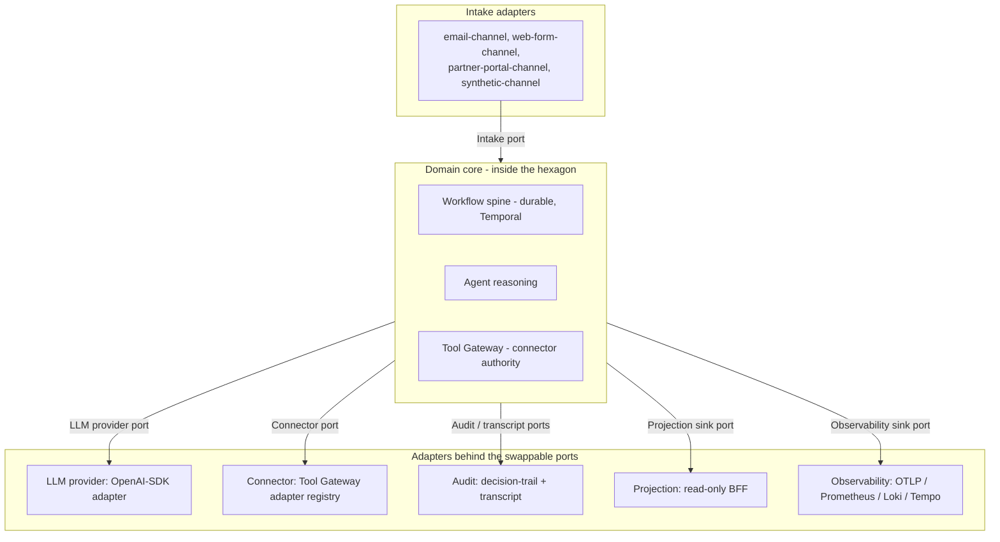

# Chorus - Overview

## Purpose

This is the project overview for Chorus. It is longer than the
[`README.md`](../README.md) and explains the architectural thesis, why the
thesis is shaped the way it is, what each named port does, and what is in and
out of scope for the repository.

The long-form thesis statement is
[`transformation/engineering-thesis.md`](transformation/engineering-thesis.md).
The architecture reference is [`architecture.md`](architecture.md). This
document sits between them.

## Architectural thesis

Chorus is a hexagonal, ports-and-adapters exemplar for governed agentic
systems, with data-contract-first design at every port. Two commitments sit
underneath that sentence.

The first is ports and adapters as the load-bearing structure. A small fixed
set of named ports separates the domain core from anything that talks to the
outside world or to a swappable subsystem. The domain core does not know which
adapter is active. The workflow code, the agent reasoning paths, and the tool
authority logic all live on the domain side of the hexagon. Providers,
transports, sandboxes, audit stores, and observability backends live on the
adapter side.

The second is contract-first at every port. Every payload crossing a port is
validated against an explicit schema before the domain core sees it and before
any adapter accepts it. Contracts are the source of truth for shape. Adapters
that violate the contract fail at the boundary, not deep in business logic.

## Why ports and adapters for governed agentic systems

The point of the thesis is not that Chorus has a clean architecture. The point
is that governed agentic systems benefit specifically from this shape.

Agents amplify the cost of every leaky boundary. A provider quirk, a
transport-level type drift, or a connector that mutates outside its grant is a
nuisance in an ordinary system. In an agentic system it becomes hard to detect
and harder to undo, because reasoning sits between input and effect: the model
can absorb a malformed payload, reason over it, and emit a plausible action
before anything has flagged that the boundary was crossed in the wrong shape.

The hexagonal boundary discipline plus contract-first validation bound that
cost. A bad payload fails at the port it tried to cross, with a contract
violation, rather than surfacing later as a wrong decision. A provider change
is contained inside one adapter. A connector cannot act without a grant, a
mode, an argument validation, and a verdict. The architecture is meant to do
work, not to be vocabulary; the thesis constrains every downstream decision,
and those constraints are listed in
[`transformation/engineering-thesis.md`](transformation/engineering-thesis.md).

## The six named ports

The hexagon has six named ports. The list is intentionally short.

The per-port adapter inventory across UC1, UC2, and UC3 is tabulated in
[`architecture.md`](architecture.md#the-hexagon-and-the-six-named-ports).

### Intake

The intake port receives inbound business work. Channel adapters sit behind
it: an email channel, a web form channel, a partner portal channel, and a
synthetic fixture channel for the local demo. Each channel adapter
contract-validates its inbound payload and normalises it to a domain-side
record, with the channel preserved as provenance. Malformed inbound is
rejected at the adapter boundary before the workflow sees it. Idempotency keys
are channel-specific and map to the domain's own work identifier.

### LLM provider

The LLM provider port carries model invocations. It is the most consequential
adapter surface in the project and must be provider-agnostic by construction.
The adapter is the OpenAI Python SDK pointed at any OpenAI-compatible
chat-completions endpoint; the SDK is treated as a transport, not as a
commitment to OpenAI as a provider. The domain core calls the port with
structured invocation arguments and receives a structured invocation result.
It never talks to a provider directly.

### Connector

The connector port is the system's external-action authority. The Tool Gateway
is its authority layer: every connector call passes a grant check, a mode
decision (dry-run versus effect), an argument validation, dispatch to the right
adapter, audit capture, and a verdict. Connector adapters are local sandbox
implementations during the local POC. Workflow code cannot reach past this
port; there is no back channel to a side service.

### Audit / transcript

The audit surface is two ports, not one. A single audit stream cannot serve
both compliance and engineering without distorting one of them. The structured
decision-trail port answers the compliance question: who decided what, under
which policy, on what input, with what output. The full-fidelity transcript
port answers the engineering question: what exactly did the model see, and
what did it return. The two ports are described in full below.

### Projection sink

The projection sink derives read models for inspection. A Postgres projection
adapter feeds the read-only BFF; a Redpanda event consumer drives the
derivation. The sink is read-only: the frontend consumes it for inspection and
demo evidence, with no write path back through it. The convergence invariant
holds that replaying the same event stream twice produces the same read-model
state.

### Observability sink

The observability sink carries traces, metrics, and logs, and optional LLM
observability. OTLP, Prometheus, Loki, and Tempo adapters sit behind it, plus
an optional LLM observability sidecar adapter configured per route. Where the
sidecar is enabled, the transcript port stays authoritative; the sidecar is
supplementary, never the accountability store.

## Use cases

Chorus carries three modelled use cases. The use cases exist to exercise the
ports; they are not three independent products.

UC1 is UK personal-lines insurance broking inbound quote qualification. A
broker firm receives inbound consumer enquiries across email, a web form, and
partner-portal submissions; each enquiry is classified, completed where data
is missing, screened for risk acceptability, and either accepted for quoting,
declined, or referred to a senior underwriter. UC1 is FCA-regulated under
general insurance distribution (ICOBS, PROD 4, Consumer Duty) and is fully
modelled in [`product-brief.md`](product-brief.md) and
[`domain-model.md`](domain-model.md).

UC2 is UK legal services intake and conflict check for a corporate and
commercial practice area, SRA-regulated, exercising KYC, beneficial-ownership,
conflict-of-interest, and AML record-keeping. It is modelled in
[`product-brief-uc2.md`](product-brief-uc2.md) and
[`domain-model-uc2.md`](domain-model-uc2.md). UC3 is UK independent financial
advice suitability intake, FCA-regulated under COBS 9 suitability, and carries
the strictest audit shape of the three. It is modelled in
[`product-brief-uc3.md`](product-brief-uc3.md) and
[`domain-model-uc3.md`](domain-model-uc3.md).

The adapter-reuse hypothesis is the centre of the thesis. The six named ports
and the workflow spine stay constant across all three use cases. The intake
channel adapters, the connector inventory, the approval policy, and the
regulator-specific audit content vary per use case. R3 and R4 produce the
evidence for or against that hypothesis: R3 landed the named-port foundation
and UC1 spine, and R4 closed the local POC evidence set. UC1 is locally
runnable through the Mailpit/email intake path. UC2 and UC3 prove shared
workflow, connector, grant, approval-package, conduct-invariant, projection,
BFF/UI inspection, and schema-only eval surfaces, but they are explicit R4
closure exceptions to the earlier use-case runnable definition. R5 has added
UC2 synthetic intake, recorded-replay route
policies for the UC2 workflow agent tasks, and workflow-path playback for one
UC2 happy fixture and one conflict-exception branch. The full mapping is in
[`r1-adapter-mapping.md`](r1-adapter-mapping.md); the closed R4 backlog is in
[`transformation/r4-implementation-backlog.md`](transformation/r4-implementation-backlog.md).
The UK-regulated use-case set is recorded in
[ADR 0020](../adrs/0020-domain-refocus-uk-regulated-use-cases.md).

## The two audit ports and replay as eval substrate

The structured decision-trail port is what a regulator or a control-framework
reviewer reads. Its records carry workflow correlation references, agent
identity and version, a policy snapshot reference, input and output summaries,
tool calls in summary form, timestamps, and cost. It is structured, queryable,
and stable.

The full-fidelity transcript port is dense and large and is not queried
directly for compliance. Its records carry the full message sequence sent to
the LLM provider, the full tool-call and tool-result sequence, the full
response body, the route catalogue entry, the model parameters as called, and
token counts where the provider reports them. Its job is to make the
invocation replayable.

That replayability is the project's eval substrate, not an incidental
capability. A captured transcript can be re-routed through the LLM provider
port against a different provider and model and compared to the original on
contract validity, decision agreement under the same policy snapshot,
tool-call divergence, and cost and latency deltas. Cross-provider replay is a
first-class eval mode. It bounds the standard objection to a provider-agnostic
architecture - hallucination and quality risk on cheaper providers - because
the divergence is observable on real, in-domain invocations, and the same data
structure that proves accountability proves model quality. The eval reshape is
described in
[`transformation/eval-reshape-directions.md`](transformation/eval-reshape-directions.md).
The two-port audit split and replay-as-eval are recorded in
[ADR 0019](../adrs/0019-audit-ports-and-replay-eval.md).

## The LLM provider port

Provider-specific code is contained inside the LLM provider adapter and exposed
only as configuration: base URL, API key, model identifier, and
provider-specific parameters such as thinking-mode toggles and tool-use schema
variants.

The port maintains a route catalogue. Every captured invocation records, at
minimum, the route name, the provider identifier, the model identifier, the
model parameters used, and the adapter version. The route catalogue plus the
transcript port together make cross-provider replay possible: without route
metadata, replay can only target the original provider; with it, replay can
target any other provider the catalogue knows how to address.

| Route | Purpose | Provider and model |
|---|---|---|
| Dev | Day-to-day reasoning during local development. | DeepSeek `deepseek-v4-flash` with thinking mode, on the official OpenAI-compatible endpoint. |
| Demo / eval canonical | The canonical demo path and the canonical eval baseline. | OpenAI `gpt-5.4-mini-2026-03-17`, the pinned snapshot of the `gpt-5.4-mini` family. |
| Replay | Deterministic local replay and the default active local route. | Local `uc1-happy-path-v1` through the `recorded-replay` route. |

The LLM provider port and its provider-neutral design are recorded in
[ADR 0018](../adrs/0018-llm-provider-port.md).
[ADR 0017](../adrs/0017-langgraph-removed-from-agent-execution.md) removed
LangGraph from the path that reaches this port.

## In scope and out of scope

In scope for the Chorus repository: the named-port architecture and its
contracts; the contract-first discipline; the workflow spine; the three
UK-regulated use cases; the local sandbox stack and connector substrate;
invariant-based eval; and cross-provider replay-eval.

Out of scope for the Chorus repository: deployment and hosting, production
identity and IAM, secrets management, backup and restore, disaster recovery,
and retention infrastructure. The Chorus repository stays runnable locally
without any hosted dependency; its job is to be a clear ports-and-adapters
reference.

Also out of scope: real third-party broker, legal, or IFA platform
integration (the use cases run on local sandboxes only), production provider
credentials beyond the local routes, and live customer data. The local demos
run on synthetic data.
